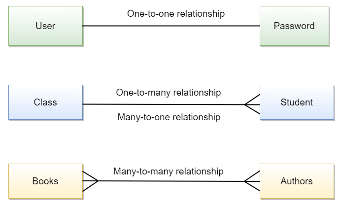
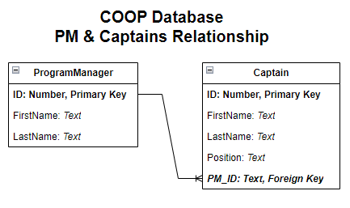

# SQL 101 - Intro to Databases and Querying

By: Martin Arroyo

## **Introduction**

Welcome to **SQL 101 - Introduction to Databases and Querying**! In this class, we will cover some of the highlights of the theory behind relational databases as well as introduce you to common SQL query patterns and concepts that you will need to know about to be successful in many analytics roles. The focus of this class is to provide you with a foundational framework of understanding how databases work, their importance in today's digital world, and how these concepts are applied on-the-job.

First, we'll start by providing an overview of the theory and concepts behind relational databases. Then we introduce you to SQL, the language of data. We teach you how to write basic data retrieval queries, as well as how to process and summarize data. 

The content that we cover here is typically delivered over the course of an entire semester at most universities. Our aim is to introduce you to the important concepts that you'll need to know to be effective in your roles. This means that we will not go into much depth when it comes to theory. To help enhance your study, where possible, we include links to external resources that cover those topics at length.

We hope that you come away from this class (as well as the subsequent 102 class) with a better understanding of databases, practical SQL skills to write basic to complex queries, and the excitement to learn more!

## **Databases & Relational Database Concepts**

### **A. What are databases?**

**Databases** are ubiquitous in today's world. Every day, we typically interact with many different databases, whether when we check our phones for updates from our favorite applications or when we go to the store and buy things we need. Without them, we would not be able to store information for very long, and the technology that we have come to depend on would not be able to function. But what is a database exactly?

A database is simply an organized collection of structured data that is stored electronically. There are many [different kinds of databases](https://www.simplilearn.com/tutorials/dbms-tutorial/what-are-various-types-of-databases) for a wide variety use cases. For this class, we will focus primarily on the most popular type - **the relational database**. 

While they will not be covered in this course, we must mention **NoSQL databases** if we are discussing relational databases. NoSQL databases can generally be considered databases that are not structured like a relational database. They typically deal with semi-structured or unstructured data, unlike relational databases which impose structure on data by default. There are many different types of NoSQL databases as well, but we won't be covering them here. However, if you are curious, [here is a resource](https://www.ibm.com/topics/nosql-databases) where you can learn more about them. 

A popular feature of relational databases is the language that is used to manage them, **Structured Query Language (`SQL`)**. Unlike relational databases, NoSQL databases - as you might expect from the name - either do not use SQL or don't *just use* SQL. 

### B. **What are relational databases?**

[Here is an optional video](https://youtu.be/NvrpuBAMddw?si=L0Cl9VrACEKoh6gR) that gives you a brief overview of Relational Databases. It may be helpful to watch this short video first, then continue on with the rest of the content.

#### **Entity Relationship Diagrams (ERD)**

We just introduced databases as well as relational databases, and discussed how they differ from NoSQL databases. But what exactly is a relational database?

Simply put, **a relational database is a type of database that stores information in tables which are related (or connected) to one another**. It's good to visualize what we mean by relationships between tables, so let's introduce you to the **Entity Relationship Diagram (ERD)**. ERD's represent a database by modeling the relationships between different entities, or *tables*, like so:

The entities in this ERD should be familiar to you - it's the COOP program structure - except this is how we might model COOP in a database based on the relationships between the different roles in the program. As mentioned earlier, entities can be thought of as the tables in our database. The boxes each represent a table in our database, and the lines between each show which ones are connected. The marks at the end of a line, known as the "Crow's Feet", indicate the type of relationship between two tables. Each table has a name and inside of the box are the attributes/column names along with their data types. We'll cover more about columns and data types a little later on.

As you can see, each of the roles in COOP (Captain, Program Manager, and Student) are represented by a table. Captains and Program Managers (PMs) are connected directly to one another since PMs are their supervisors. Then we see that Apprentices connected to the Cohort, just as you are an apprentice who are assigned to one cohort. Finally, the Cohort is the glue that connects the Captains to Apprentices (and by extension the PMs.)

#### **Types of Relationships**

Earlier, we mentioned that the "Crow's Feet" notation indicated the type of relationship between the two tables. In relational databases, **the type of the relationship between two tables indicates how the rows in one table are related to the rows in another**. This is an important consideration when designing databases as well as when you want to combine the data in two or more tables. **There are three main types of relationships: `One-to-One`, `One-to-Many`, and `Many-to-Many`**. 

Let's imagine we have two tables, `Table A` and `Table B`, that are related:
- **`One-to-One`**: This means that exactly one row in `Table A` is related to exactly one (and only one) row in `Table B`. An example of this type of relationship would be between a user and their password - one user should have, at most, one password.
- **`One-to-Many`**: One row in `Table A` can be matched to one or more rows in `Table B`. A real-life example would be the relationship between the `ProgramManager` and `Captain` tables, where one Program Manager supervises many captains, but each captain reports to just one Program Manager.
- **`Many-to-Many`**: One or more rows in `Table A` can be matched to one or more rows in `Table B`. An example of this is the relationship between the `Apprentice` and `Captain` tables - each `Captain` has multiple Apprentices and each `Apprentice` has multiple Captains.  

Click to see a visual representation of Crow's Foot Notation and Relationship Types

#### **Tables, Columns, and Rows**

In relational databases, our data is stored in a tabular structure (a.k.a. a "table") called a relation. However, it is much more common to refer to relations as tables, so going forward, when will be using the terms interchangeably. **Tables are 2-dimensional structures that store data in rows and columns**. 

**Each table typically represents an "entity" or some "thing" we would like to model**. Using our ERD example from earlier, an `Apprentice` would be considered an entity. 

**Columns represent attributes about an entity**. Continuing with our example, some attributes of an `Apprentice` includes their name and their cohort ID. 

**Rows each represent a single entity record for the table**. In the Apprentices table, each row would represent one Apprentice. 

The structure of tables in a relational database is similar to how we arrange data in spreadsheets (like Excel.)

#### **Data Types and Structure**

**Attributes of an entity have both a type (the kind of data it is) and a value (the data itself.)** For example, the `FirstName` attribute for the `Apprentice` table is text data, so we would consider "text" to be its data type, and a possible value could be "Angela". The data type is very important because columns will only support one data type each. In Excel, you are allowed to input any type of data in a column that you would like - one cell of a column can have a number and the next cell in that same column can have a text value. However, that is where SQL and Excel differ. 

SQL helps impose structure on our data by making it so that all the values in a column must share the same data type. This is necessary when we are doing things making calculations based on our data. As an example, if we summarize the data in a column of numbers, we would want to be sure that each value in that column is indeed a number, otherwise you may get incorrect results or errors.

#### **Keys to Establishing Relationships - Primary Keys and Foreign Keys**

So far, we have seen how entities/tables can be related to one another and the types of relationships they can have (one-to-one, one-to-many, and many-to-many.) But the key (pun fully intended) to establishing these relationships lies in the concept of **Primary Keys** and **Foreign Keys**.

**Primary Keys are a column (or multiple columns) in a table that identify a unique record**. In our COOP example, the `ID` column in the `ProgramManager` table would be considered a primary key because it uniquely identifies a single Program Manager. 

**Foreign Keys are used to formally establish a relationship between two tables in the database and do not need to uniquely identify rows**. Typically, one table will have a column that references the Primary Key of another table. The column in the table that references the Primary Key in this example is called the Foreign Key. One way to think about this is by using a parent-child relationship as an example - the "parent" table in this case is the one with the Primary Key that the "child" table (with the Foreign Key) refers to. This is effectively establishing a one-to-many relationship between the "parent" and "children", since parent's can have one ore more "children" while children (in this scenario!) have one and only parent.  

To illustrate this further, let's look at the `ProgramManager` and `Captain` tables, which have a one-to-many relationship, in our ERD:

The `PM_ID` column in the `Captain` table is the Foreign Key in this relationship, since it references the `ID` column of `ProgramManager`, which is the Primary Key of that table. Put another way, the relationship between `ProgramManager` and `Captain` is similar to the parent-child example since they are both one-to-many relationships established through the Primary Key(`ID`) in the "parent" table (`ProgramManager`) and the Foreign Key(`PM_ID`) in the "child" table (`Captain`). 

Understanding these relationships is important when we want to combine data from two or more tables, as we will need to know what columns establish that relationship between the tables in order to join them.

Here are some more resources on [Primary Keys](https://www.w3schools.com/sql/sql_primarykey.asp) and [Foreign Keys](https://www.w3schools.com/sql/sql_foreignkey.asp).

#### **Schemas and Metadata**

**Schemas can be a little confusing at first because the term can be used to refer one of two things: the structure of a table or the structure of a database**. When we talk about the schema of a table, we are referring to the table's name as well as the structure of the table, such as the column names and their data types. However, when referring to the structure of a database, the schema describes the tables (e.g. tables names) that are in the database. **So we really have two types of schemas: table schemas and database schemas**. When you hear the word "schema", it could potentially mean either one of these, so it's important to understand the context in which it is mentioned; **when in doubt, clarify whether the table or database schema is being referred to.** 

**Metadata is a set of data that describes another set of data**. Since schemas describe either tables or databases, they are considered a type of metadata. Knowing the metadata of either the table or the database that you are using is important as it gives you critical context and information to help in your analysis.

#### **Normalization, Denormalization, and OLTP vs OLAP**

Normalization and denormalization are data modeling methods that have different goals for data storage and retrieval. **Normalization is used when we want to ensure the consistency and integrity of the data by eliminating redundancy (e.g. duplicate values.)** This is achieved by dividing the tables into smaller sub-tables until redundant data are eliminated. **Denormalization, on the other hand, favors easier querying of the data and achieves this by combining data/tables together, even if it introduces redundancy.**

The normalization method is typically used in **Online Transactional Processing (OLTP) systems, which are use to model real-time transactions, favoring (write) speed, consistency, and data integrity**. Relational databases are used to create this model because of the strong emphasis on structure. **Online Analytical Processing (OLAP) systems, which generally use a denormalized structure for data, are used when querying and analyzing the data is more important than being able to store data quickly and without redundancy**. OLAP systems can be built using relational databases but may also be built using other types of databases.

As data analysts, you may work with databases that are either OLTP or OLAP systems. The most common system used for data analytics is OLAP, which often models data in what are known as data warehouses. Data Warehouses combine data from multiple sources within a business to create a unified, holistic view of the data for reporting and analysis. This is a topic that books are devoted to and is out of the scope of what we will cover in our class. [This article](https://www.oracle.com/database/what-is-a-data-warehouse/) expands on the concept further.  

Normalization, denormalization, OLTP, and OLAP are all concepts that go much deeper than the treatment given here. For our purposes, we will not dive into this further. However, if you would like to learn more, here are some resources you can use:

- [OLTP vs OLAP](https://aws.amazon.com/compare/the-difference-between-olap-and-oltp/)
- [Normalization vs Denormalization](https://medium.com/analytics-vidhya/database-normalization-vs-denormalization-a42d211dd891#:~:text=Normalization%20is%20the%20technique%20of,to%20make%20data%20retrieval%20faster.)

#### **Relational Database Management System (RDBMS)**

Until now, we have mostly been describing the relational database from a theoretical perspective. **However, when we interact with a relational database on a computer, we do so using a Relational Database Management System (RDBMS)**. The RDBMS essentially brings the relational database model to life and makes it something we can actually use by handling the physical storage of the data. There are quite a few different RDBMS's out there, such as **Postgresql, MySQL, Oracle and SQL Server**. An important thing to note is that each RDBMS uses a slightly different version of SQL, so the syntax can be different for some queries between SQL Server and Postgres, for example. 

**Why use a Relational Database instead of just working with data in Excel (or a similar spreadsheet software)?**

While there are still instances where data is stored exclusively in spreadsheets, this is becoming less and less common. And once a business reaches a certain size, using a database is a necessity. Here are a few reasons why:

1. **RDBMS's can store much more information than spreadsheets can.** Excel, for example, has hard limits on the number of rows and columns that can be stored in both a single sheet as well as a workbook. Even if you are below these limits, Excel can become difficult to use once you are working with larger data sets (think hundreds of thousands 
to a million rows.)
2. **RDBMS's allow for many people to collaborate and use the same data source all at once.** While you can share Excel workbooks with one another and even work collaboratively, once you get to more than a handful of people working on updating the same document the process quickly becomes unwieldy. Conflicts begin to creep up more and more often, and there is a good chance that work can be lost or overwritten easily, costing hours of productivity. This is not an issue with RDBMS's as they are designed to handle many people using them all at once.
3. **Relational Databases and RDBMS's help ensure the integrity and structure of the data.** This is critical when data is updated on a regular basis. Excel does not have mechanisms built in to guarantee the integrity and structure of the data (e.g. Are the data types of each column consistent?)
4. **RDBMS's provide more security for your data than spreadsheets.** While it is possible to encrypt Excel workbooks, these are not robust against a determined attacker. On the other hand, RDBMS's have access control capabilities built-in which allow you to control who has access to what data and what level of access they should have. They are far more robust to security issues than spreadsheets.

These are the main reasons for using an RDBMS to store data over a spreadsheet. However, there are exceptions where storing data in a spreadsheet may be preferable, such as when the data you need to store is relatively small, it doesn't need to be updated, and it doesn't need to be kept particularly secure. All in all, the decision of what storage method to use should always be tied back to your needs and use case(s). 

### **What is SQL?**

**Structured Query Language (SQL - pronounced *"Sequel"*)** was created in the early 1970s by researchers at IBM based on [the relational model that was described by Edgar F. Codd](https://dl.acm.org/doi/10.1145/362384.362685). It is a domain-specific programming language that is used for querying and maintaining a RDBMS.

SQL is also known as a declarative language. This means that when we write queries in SQL, we are describing the results that we want rather than describing, step-by-step, how the RDBMS should retrieve the data. Since it is declarative, SQL can feel easier to learn because the syntax is simple and simpler to think about than other languages. 

Another important point to reiterate is that SQL itself is just a specification. **Different RDBMS vendors create their own versions of SQL** based on that specification. This is why the syntax between the SQL for one RDBMS will differ (albeit slightly) from that of another RDBMS system. In practice, this means that you should always be aware of what RDBMS you are using so that you know which set of documentation you would need to use.

**SQL Sub-languages**

SQL can be further divided into five sub-languages, each of which contains commands for specific tasks such as creating databases, manipulating data, or querying data. Of the five, we will primarily focus on the Data Query Language (DQL). The five sub-languages are, in no particular order:
- **Data Defintion Language (DDL)**: Used for creating or modifying the structure of tables or databases. Common DDL commands include `CREATE`, `DROP`, or `ALTER`
- **Data Manipulation Language (DML)**: Used for manipulating data that is already stored in the database, typically by either adding, removing, or updating the data. Common DML commands include `INSERT`, `UPDATE`, and `DELETE`.
- **Data Query Language (DQL)**: Used for querying data in the database. DQL is where the `SELECT` command comes from.
- **Data Control Language (DCL)**: Used for granting or modifying access to data stored in tables. Common DCL commands include `GRANT` and `REVOKE`.
- **Transaction Control Language (TCL)**: Used for controlling transactions in the database. Common TCL commands include `COMMIT`, `SAVEPOINT`, and `ROLLBACK`.

    
Click here to see a complete listing of the SQL commands found in each sub-language

    

### What's next?

We have only scratched the surface of the topics that were introduced here. And there are yet more topics that we are not covering in here because to include and properly explain them all would require at least a semesters worth of time. However, as promised, there are other resources that we encourage you to utilize to further your studies and knowledge on databases. Here are some that we recommend:

- [Database Systems - Full Course from Cornell University (Offered through `freecodecamp`)](https://youtu.be/4cWkVbC2bNE?si=YiIIUs7E1ShmJRgc)
- [Database vs Data Warehouse vs Data Lake (Alex the Analyst)](https://youtu.be/4cWkVbC2bNE?si=YiIIUs7E1ShmJRgc)
- [Data Warehouse Toolkit, 3rd Edition (Kimball)](https://www.academia.edu/19222417/The_Data_Warehouse_Toolkit_3rd_Edition)
- [Primary Keys and Foreign Keys Explained](https://youtu.be/B5r8CcTUs5Y?si=asEl57bsIEVpghrE)
- [SQL Tutorial - Full Database Course for Beginners (Offered through `freecodecamp`)](https://youtu.be/HXV3zeQKqGY?si=kXKxJS0quRQYpZoPs)

The rest of the material in SQL 101 is devoted to teaching you the basics of SQL querying that can be applied to just about any version of the language you may encounter.