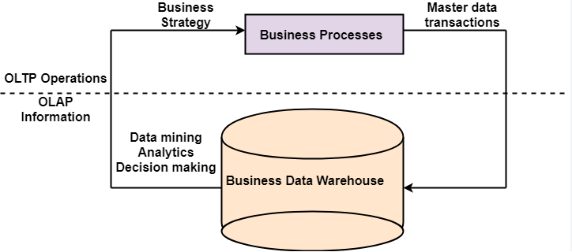

# SQL 101 - Intro to Databases and Querying

By: Martin Arroyo

### Table of Contents:

* [**Introduction**](#introduction)

* [**Databases & Relational Database Concepts**](#databases--relational-database-concepts)
    - [**What are databases?**](#what-are-databases)
    - [**What are relational databases?**](#what-are-relational-databases)
        - [**Entity Relationship Diagrams (ERD)**](#entity-relationship-diagrams-erd)
        - [**Types of Relationships**](#types-of-relationships)
        - [**Tables, Columns, and Rows**](#tables-columns-and-rows)
        - [**Data Types and Structure**](#data-types-and-structure)
        - [**Keys to Establishing Relationships - Primary Keys and Foreign Keys**](#keys-to-establishing-relationships---primary-keys-and-foreign-keys)
        - [**Schemas and Metadata**](#schemas-and-metadata)
        - [**Normalization, Denormalization, and OLTP vs OLAP**](#normalization-denormalization-and-oltp-vs-olap)
        - [**Relational Database Management System (RDBMS)**](#relational-database-management-system-rdbms)

* [**What is SQL?**](#what-is-sql)
    - [**SQL Sub-languages**](#sql-sub-languages)

* [**What's next?**](#whats-next)

## **Introduction**

Welcome to **SQL 101 - Introduction to Databases and Querying**! In this class, we will cover some of the highlights of the theory behind relational databases as well as introduce you to common SQL query patterns and concepts that you should know to be successful in many analytics roles. The focus of this class is to provide you with a foundational framework to understand how databases work, their importance in today's digital world, and how these concepts are applied on-the-job.

First, we'll start by providing an overview of the theory and concepts behind relational databases. Then we introduce you to SQL, the language of data. We teach you how to write basic data retrieval queries, as well as how to process and summarize data. 

The content that we cover here is typically delivered over the course of an entire semester at most universities. Our aim is to introduce you to the important concepts that you'll need to know to be effective on the job. This means that we will not go into as much depth as a university course when it comes to theory. We include links to external resources that cover those topics at length to help enhance your study. While being effective is great, you can greatly enhance your effectiveness by understanding the theory behind things. We hope that this material sparks an interest in you to study databases further.

You will come away from this class (as well as the subsequent 102 class) with a better understanding of databases, practical SQL skills to write basic to complex queries, and the excitement to learn more!

[Back to top](#table-of-contents)

## **Databases & Relational Database Concepts**

### **What are databases?**

**Databases** are ubiquitous in today's world. Every day, we interact with many different databases, whether when checking our phones for updates on our favorite applications or when we go to the store and buy things. Without them, we would not be able to store information for very long, and much of the technology that we have come to depend on would not be able to function. But what is a database exactly?

A database is simply an organized collection of data that is stored electronically. Imagine a digital library where tons of books are organized and stored, and you can access any one you like by asking for what you want - that is what a database is like. There are many [different kinds of databases](https://www.simplilearn.com/tutorials/dbms-tutorial/what-are-various-types-of-databases) for a wide variety use cases. For this class, we will focus primarily on one of the most popular types - **the relational database**. 

While they will not be covered in this course, we should mention **NoSQL databases** if we are discussing relational databases. NoSQL databases can generally be thought of as databases which are not structured like a relational database. They typically handle semi-structured or unstructured data, unlike relational databases which impose structure on data by default. There are many different types of NoSQL databases. If you are curious, [here is a resource](https://www.ibm.com/topics/nosql-databases) where you can learn more about them. 

A popular feature of relational databases is the language that is used to manage them, **Structured Query Language (SQL)**. Unlike relational databases, NoSQL databases - as you might expect from the name - either do not use SQL or don't *just use* SQL. 

>**<em>A note about the modern data stack and nascent technologies in the data ecosystem:</em>**
>
>Relational database system architectures have been around and evolving somewhat since they were first introduced in the 1970s. However, as the amount of data in the world continues to grow massively, new database architectures and paradigms have risen to meet the increased processing and storage needs. Architectures such as Data Lakes, Data Lakehouses, and Distributed Databases are some examples of newer methods for storing data. The details of such systems are outside of the scope of this course since it is focused on data analysis using SQL. But if you are interested in pursuing a role in a specialty like data engineering, then it would be worth it to study these topics in addition to relational databases.
>
>An interesting thing to note is that, for these newer architectures, there is a common language that is being used to query and manipulate the data in them - SQL! While they are not relational databases, SQL has become so ubiquitous that the designers of these systems made sure it was a key component. That's one of the reasons why SQL is a critical skill for any data professional! 

[Back to top](#table-of-contents)

### **What are relational databases?**

[Here is an optional video](https://youtu.be/NvrpuBAMddw?si=L0Cl9VrACEKoh6gR) that gives you a brief overview of Relational Databases. It may be helpful to watch this short video first, then continue on with the rest of this reading.

#### **Entity Relationship Diagrams (ERD)**

We just introduced databases, as well as relational databases, and discussed how they differ from NoSQL databases. But what exactly is a relational database?

Simply put, **a relational database is a type of database that stores information in tables which are related (or connected) to one another**. It's good to visualize what we mean by relationships between tables, so let's introduce you to the **Entity Relationship Diagram (ERD)**. ERD's are used to represent a database by modeling the relationships between different entities, or *tables*, using a type of flowchart like the one shown below:

The entities in this ERD should be familiar to you - it's the COOP program structure - except this is how we might model COOP in a database based on the relationships between the different roles in the program. As mentioned earlier, entities can be thought of as the tables in our database. The boxes each represent a table in our database, and the lines between each entity shows which ones are connected. The marks at the end of a line, known as the "Crow's Foot", indicate the type of relationship between the two tables. Each table has a name, and inside of the box are their attributes/column names along with their data types. We'll cover more about columns, data types, and relationships a little later on.

As you can see, each of the roles in COOP (Captain, Program Manager, and Student) are represented by a table. Captains and Program Managers (PMs) are connected directly to one another since PMs are their supervisors. Then we see that Apprentices are connected to the Cohort, just as you are an apprentice who is assigned to one cohort. Finally, the Cohort is the glue that connects the Captains to Apprentices (and by extension the PMs.)

[Back to top](#table-of-contents)

#### **Types of Relationships**

Earlier, we mentioned that the "Crow's Foot" notation indicated the type of relationship between the two tables. In relational databases, **the type of the relationship between two tables indicates how the rows in one table are related to the rows in another**. This is an important consideration when designing databases, as well as when you want to combine the data in two or more tables. **There are three main types of relationships: `One-to-One`, `One-to-Many`, and `Many-to-Many`**.

Let's imagine we have two tables, `Table A` and `Table B`, that are related:
- **`One-to-One`**: This means that exactly one row in `Table A` is related to exactly one (and only one) row in `Table B`. An example of this type of relationship would be between a user and their password - one user should have, at most, one password.
- **`One-to-Many`**: One row in `Table A` can be matched to one or more rows in `Table B`. A real-life example would be the relationship between the `ProgramManager` and `Captain` tables, where one Program Manager supervises many captains, but each captain reports to just one Program Manager.
- **`Many-to-Many`**: One or more rows in `Table A` can be matched to one or more rows in `Table B`. An example of this is the relationship between the `Apprentice` and `Captain` tables - each `Captain` has multiple Apprentices and each `Apprentice` has multiple Captains.  

---

**<em>Comprehension Check</em>**

Answer the questions below to check your understanding of what we have covered so far. Try to answer the questions first before looking at the answers:

*1. What is a database?*

    
Click to reveal the answer

    
A database is an organized collection of data stored electronically.

 

*2. What are some of the differences between relational databases and NoSQL databases?*

    
Click to reveal the answer

    
Relational databases use SQL exclusively for management where NoSQL databases either don't use SQL at all or don't just use SQL; Relational databases impose structure on data. NoSQL databases typically deal with semi-structured or unstructured data.

 

*3. What type of relationship is modeled between the entities in our COOP Program ERD?*

    
Click to reveal the answer

    
The relationships in our chart are all One-to-Many relationships. This is denoted by the use of the crow's foot notation on only one side of our line connecting the entities. Learn more about crow's foot notation <a href="https://vertabelo.com/blog/crow-s-foot-notation/" target="_blank">here</a>.

---

[Back to top](#table-of-contents)

#### **Tables, Columns, and Rows**

In relational databases, our data is stored in a tabular structure called a relation. However, it is much more common to refer to relations as tables. We will be using the terms interchangeably. **Tables are 2-dimensional structures that store data in rows and columns**. 

**Each table typically represents an "entity" or some "thing" we would like to model in our database**. Using our ERD example from earlier, an `Apprentice` would be considered an entity. 

**Columns represent attributes about an entity**. Continuing with our example, some attributes of an `Apprentice` includes their `FirstName` and their `CohortID`. 

**Rows each represent a single entity record for the table**. In the Apprentices table, each row would represent one Apprentice. 

The structure of tables in a relational database is similar to how we arrange data in spreadsheets (like Excel.)

[Back to top](#table-of-contents)

#### **Data Types and Structure**

**Attributes of an entity have both a type (the kind of data it is) and a value (the data itself.)** For example, the `FirstName` attribute for the `Apprentice` table is text data, so we would consider "text" to be its data type, and a possible value could be "Angela". The data type is very important because columns will only support one data type each. In Excel, you are allowed to input any type of data in a column that you would like - one cell of a column can have a number and the next cell in that same column can have a text value. However, that is where SQL and Excel differ. 

SQL helps impose structure on our data by making it so that all the values in a column must share the same data type. This is necessary when we are doing things making calculations based on our data. As an example, if we summarize the data in a column of numbers, we would want to be sure that each value in that column is indeed a number, otherwise you may get incorrect results or errors.

[Back to top](#table-of-contents)

#### **Keys to Establishing Relationships - Primary Keys and Foreign Keys**

So far, we have seen how entities/tables can be related to one another and the types of relationships they can have (one-to-one, one-to-many, and many-to-many.) But the key (pun fully intended) to establishing these relationships lies in the concept of **Primary Keys** and **Foreign Keys**.

**Primary Keys are a column (or multiple columns) in a table that identify a unique record**. In our COOP example, the `ID` column in the `ProgramManager` table would be considered a primary key because it uniquely identifies a single Program Manager. You might be thinking, "why not just use the `FirstName`, `LastName`, or a combination of the two instead?" The reason we wouldn't be able to use those columns as unique identifiers in our table is because it is possible that there would be Program Managers with the same first and last name. Therefore, neither of those columns (or their combination) can be used as a reliable indicator of uniqueness.

**Foreign Keys are used to formally establish a relationship between two tables in the database and do not need to uniquely identify rows**. Typically, one table will have a column that references the Primary Key of another table. The column in the table that references the Primary Key in this example is called the Foreign Key. One way to think about this is by using a parent-child relationship as an example - the "parent" table in this case is the one with the Primary Key that the "child" table (with the Foreign Key) refers to. This is effectively establishing a one-to-many relationship between the "parent" and "children", since parent's can have one ore more "children" while children (in this scenario!) have one and only parent.  

To illustrate this further, let's look at the `ProgramManager` and `Captain` tables, which have a one-to-many relationship, in our ERD:

The `PM_ID` column in the `Captain` table is the Foreign Key in this relationship, since it references the `ID` column of `ProgramManager`, which is the Primary Key of that table. Put another way, the relationship between `ProgramManager` and `Captain` is similar to the parent-child example since they are both one-to-many relationships established through the Primary Key(`ID`) in the "parent" table (`ProgramManager`) and the Foreign Key(`PM_ID`) in the "child" table (`Captain`). 

Understanding these relationships is important when we want to combine data from two or more tables, as we will need to know what columns establish that relationship between the tables in order to join them.

Here are some more resources on [Primary Keys](https://www.w3schools.com/sql/sql_primarykey.asp) and [Foreign Keys](https://www.w3schools.com/sql/sql_foreignkey.asp).

---

**<em>Comprehension Check</em>**

Answer the questions below to check your understanding of what we have covered so far. Try to answer the questions first before looking at the answers:

*1. What do tables, columns, and rows represent in a relational database?*

    
Click to reveal the answer

    
Tables represent entities or things in a database. Columns are part of a table and represent the attributes of an entity. Rows each represent one record of an entity in a given table.

 

*2. What role do data types play in structuring data in a relational database?*

    
Click to reveal the answer

    
Data Types are used to help ensure that the data in a column are all consistent.

 

*3. What is the difference between a primary key and a foreign key?*

    
Click to reveal the answer

    
Primary Keys are used to identify unique rows in a table. Foreign Keys are used to formally establish relationships between tables in the database. Often, a foreign key will establish a relationship with a primary key in another table.

---

[Back to top](#table-of-contents)

#### **Schemas and Metadata**

**Schemas describe how data is organized in a database**. It is a broad term that, in practice, can refer to different scopes of organization in the database.
They can refer to the:

- **Structure of a single table**: When we talk about the schema of a table, we are referring to the table's name as well as the structure of the table, such as the column names and their data types. 

- **Collections of tables within a database**: Databases can be subdivided into different schemas, which each have their own collection of tables. For example, the tables in our COOP database could potentially be split into an "Employee" schema (`ProgramManager` and `Captain`) and a "Student" schema (`Apprentice`, `Cohort`). 

- **Set of ALL tables in a database**: When referring to the structure of a database as a whole, the schema describes the entire set of all tables (e.g. tables names and schemas) in the database.  

When you hear the word "schema", it could potentially mean any one of these, so **it's important to understand the context in which it is mentioned; when in doubt, clarify which schema is being referred to.** 

**Metadata is a set of data that describes another set of data**. An example of metadata in every day life would be the table of contents or a summary of a book. Since schemas describe how data are organized in databases, they are considered a type of metadata. Knowing the metadata of either the table or the database that you are using is important as it gives you critical context and information for any analysis you may do.

[Back to top](#table-of-contents)

#### **Normalization, Denormalization, and OLTP vs OLAP**

Normalization and denormalization are data modeling methods that have different goals for data storage and retrieval. **Normalization is used when we want to ensure the consistency and integrity of the data by eliminating redundancy (e.g. duplicate records.)** This is achieved by dividing the tables into smaller sub-tables until redundant data are eliminated. **Denormalization, on the other hand, favors easier querying of the data and achieves this by combining data/tables together, even if it may introduce redundancy.**

>**Extra Context**: *What exactly is redundancy in a database and why does it matter?*
>
>Redundancy in a database refers to the unnecessary repetition of data or storing the same piece of information in multiple places. It matters because it can lead to increased storage costs, data inconsistencies, and complications in data updates and retrieval. By reducing or eliminating redundancy, the integrity (accuracy and consistency) of the data is maintained.

The normalization method is typically used in **Online Transactional Processing (OLTP) systems, which are use to model real-time transactions, favoring (write) speed, consistency, and data integrity**. Relational databases are used to create this model because of the strong emphasis on structure. OLTP typically has a focus on business-critical applications, meaning items that need to be processed and recorded in real-time. Examples of this kind of processing would be managing inventory in a warehouse or credit card transactions. Data in these databases are not usually kept for very long, so there is little historical data generally available in these systems.

**Online Analytical Processing (OLAP) systems, which generally use a denormalized structure for data, are used when querying and analyzing historical data is more important than being able to store data quickly and without redundancy**. OLAP systems can be built using relational databases, but may also be built using other types of databases or architectures (e.g. [Data Lakes](https://aws.amazon.com/big-data/datalakes-and-analytics/what-is-a-data-lake/)). These systems are used for information mining and gathering insights for a business. They typically store much more data than OLTP systems as it is essentially an archive of historical data that is continuously added to. Very often, the data source for an OLAP system will be the data from an OLT System.

While OLTP systems will generally use normalization and OLAP systems denormalization, it's important to point out that this isn't a hard and fast rule. There may be cases where denormalization is preferred in an OLTP system, as well as using normalization in OLAP systems. This is context and use-case dependent, so you will need to understand how the particular database you are using was structured. 

The diagram below shows a high-level breakdown of how OLTP and OLAP systems are used:

As data analysts, you may work with databases that are either OLTP or OLAP systems. The most common system used for data analytics is OLAP, which often models data in what are known as data warehouses. Data Warehouses combine data from multiple sources within a business to create a unified, holistic view of the data for reporting and analysis. This is a topic that books are devoted to and is out of the scope of what we will cover in our class. [This article](https://www.oracle.com/database/what-is-a-data-warehouse/) expands on the concept further.  

Normalization, denormalization, OLTP, and OLAP are all concepts that go much deeper than the treatment given here. For our purposes, we will not dive into these topics further. However, if you would like to learn more, here are some resources we recommend:

- [OLTP vs OLAP](https://aws.amazon.com/compare/the-difference-between-olap-and-oltp/)
- [Normalization vs Denormalization](https://medium.com/analytics-vidhya/database-normalization-vs-denormalization-a42d211dd891#:~:text=Normalization%20is%20the%20technique%20of,to%20make%20data%20retrieval%20faster.)
- [When and How You Should Denormalize a Relational Database](https://www.linkedin.com/pulse/when-how-you-should-denormalize-relational-database-pathuri/)

---

**<em>Comprehension Check</em>**

Answer the questions below to check your understanding of what we have covered so far. Try to answer the questions first before looking at the answers:

*1. What is a schema, and what are two possible things it could refer to?*

    
Click to reveal the answer

    
The schema refers to the organization of data inside of a database. Data can be organized according to different scopes. For tables, a table schema provides metadata about a specific table, such as the name, the column names, and their data types. A database schema provides metadata about the database as a whole, including the names of the tables that are in it and the possible schemas that the tables are organized intos. It could also simply refer to a collection of tables within a database.

 

*2. When do we use denormalization to store our data in a database?*

    
Click to reveal the answer

    
Denormalization is used when we want to focus on querying and analyzing historical data.

 

*3. What is the difference between OLTP and OLAP Systems? As a Data Analyst, which type of system are you more likely to work in?*

    
Click to reveal the answer

    
OLTP Systems focus more on real-time business processes and applications. OLAP Systems focus on making historical data easily available for querying and analysis. As Data Analysts, you may work with both systems, but are more likely to work in an OLAP system.

---

[Back to top](#table-of-contents)

#### **Relational Database Management System (RDBMS)**

Until now, we have mostly been describing the relational database from a theoretical perspective. **However, when we interact with a relational database on a computer, we do so using a Relational Database Management System (RDBMS)**. The RDBMS essentially brings the relational database model to life and makes it something we can actually use by handling the physical storage of the data on a device. Think of it like the engine in a car - while we interact with the exterior of the car, the engine is what makes sure it runs smoothly. 

There are quite a few different RDBMS's out there, such as **Postgresql, MySQL, Oracle and SQL Server**. An important thing to note is that each RDBMS uses a slightly different version of SQL (these are called *dialects*.) This means that the syntax can be different for some queries between SQL Server and Postgres, for example. 

**Why use a Relational Database instead of just working with data in Excel (or a similar spreadsheet software)?**

While there are still instances where data is stored exclusively in spreadsheets, this is becoming less and less common. As the amount of data to be analyzed grows, using a database eventually becomes a necessity. Here are a few reasons why:

1. **RDBMS's can store much more information than spreadsheets can.** Excel, for example, has hard limits on the number of rows and columns that can be stored in both a single sheet as well as a workbook. Even if you are below these limits, Excel can become difficult to use once you are working with larger data sets (think hundreds of thousands to a million or more rows.)
2. **RDBMS's allow for many people to collaborate and use the same data source all at once.** While you can share Excel workbooks with one another and even work collaboratively, once you get to more than a handful of people working on updating the same document the process quickly becomes unwieldy. Conflicts begin to creep up more and more often, and there is a good chance that work can be lost or overwritten easily, costing hours of productivity. This is not an issue with RDBMS's as they are designed to handle many people using them all at once.
3. **Relational Databases and RDBMS's help ensure the integrity and structure of the data.** This is critical when data is updated on a regular basis. Excel does not have any mechanisms built-in to guarantee the integrity and structure of the data.
4. **RDBMS's provide more security for your data than spreadsheets.** While it is possible to encrypt spreadsheets, these methods are not robust against a determined attacker. On the other hand, RDBMS's have access control capabilities built-in, which allow you to control who has access to what data and what level of access they should have. They are generally more secure than spreadsheets.

These are the main reasons for using an RDBMS to store data over a spreadsheet. However, there are exceptions where storing data in a spreadsheet may be preferable, such as when the data you need to store is relatively small, it doesn't need to be updated, and it doesn't need to be kept particularly secure. All in all, the decision of what storage method to use should always be tied back to your needs and use case(s). 

[Back to top](#table-of-contents)

## **What is SQL?**

**Structured Query Language (SQL - pronounced <em>"Sequel"</em>)** was created in the early 1970s by researchers at IBM based on [the relational model that was described by Edgar F. Codd](https://dl.acm.org/doi/10.1145/362384.362685). It is a domain-specific programming language that is used for querying and managing a RDBMS.

>**Extra Context**: *The math behind relational databases*
>
>[Relational algebra](https://www.geeksforgeeks.org/introduction-of-relational-algebra-in-dbms/) is a set of mathematical operations that define the foundation for querying relational databases. It provides a theoretical framework consisting of operations like selection, projection, union, set difference, and Cartesian product to manipulate data sets (relations). SQL, the standard language for querying relational databases, is essentially a practical implementation of these concepts, translating relational algebra operations into familiar, user-friendly query syntax.
>
>For those who want a challenge, after completing SQL 101, see if you can go back and translate your queries into expressions using Relational Algebra!

SQL is also known as a declarative language. This means that when we write queries in SQL, we are describing what data we want rather than describing, step-by-step, how the RDBMS should retrieve that data. The syntax is relatively simple to learn and writing queries can feel more intuitive which makes SQL a beginner-friendly language. 

Another important point to reiterate is that SQL itself is just a specification. **Different RDBMS vendors implement their own versions of SQL** based on that specification. This is why the syntax between the SQL for one RDBMS will differ (albeit slightly) from that of another RDBMS system. In practice, this means that you should always be aware of what RDBMS you are using so that you know what language features are available to you (and what documentation to use.)

Overall, you can think of SQL as a translator between you and a vast library of information. You ask it (query) for specific books or details (data,) and it fetches them for you. It's important to emphasize that when we write queries, we are asking for what we want (declarative) rather than telling the database how to retrieve our data (this would be considered ["imperative."](https://www.educative.io/blog/declarative-vs-imperative-programming))

### **SQL Sub-languages**

SQL can be further divided into five sub-languages, each of which contains commands for specific tasks like creating databases or manipulating and querying data. Of these five, we will focus on the Data Query Language (DQL). The five sub-languages are, in no particular order:
- **Data Definition Language (DDL)**: Used for creating or modifying the structure of tables or databases. Common DDL commands include `CREATE`, `DROP`, or `ALTER`
- **Data Manipulation Language (DML)**: Used for manipulating data that is already stored in the database, typically by either adding, removing, or updating the data. Common DML commands include `INSERT`, `UPDATE`, and `DELETE`.
- **Data Query Language (DQL)**: Used for querying data in the database. DQL is where the `SELECT` command comes from.
- **Data Control Language (DCL)**: Used for granting or modifying access to data stored in tables. Common DCL commands include `GRANT` and `REVOKE`.
- **Transaction Control Language (TCL)**: Used for controlling transactions in the database. Common TCL commands include `COMMIT`, `SAVEPOINT`, and `ROLLBACK`.

---

**<em>Comprehension Check</em>**

Answer the questions below to check your understanding of what we have covered so far. Try to answer the questions first before looking at the answers:

*1. What does SQL stand for?*

    
Click to reveal the answer

    
Structured Query Language.

 

*2. When would we use a Relational Database Management System? When would it be best to just use a spreadsheet?*

    
Click to reveal the answer

    
We would use a Relational Database Management System when we are working with a lot of data that is consistently updated and need to have a lot of people work on that data simultaneously. However, when you don't need a lot of people to work on the data and it is not updated very often (or at all) then a spreadsheet is sufficient.

 

*3. Which sub-language of SQL will we be focused on for the purpose of writing queries?*

    
Click to reveal the answer

    
Data Query Language (DQL).

---

[Back to top](#table-of-contents)

### What's next?

We have only scratched the surface of the topics that were introduced here. There is so much more to cover, but doing so could fill up at least a semester or more. However, there are many free resources that you can use to dive deeper into databases and SQL. Here are some external resources that we encourage you to use to enhance your studies:

- [Database Systems - Full Course from Cornell University (Offered through `freecodecamp`)](https://youtu.be/4cWkVbC2bNE?si=YiIIUs7E1ShmJRgc)
- [Database vs Data Warehouse vs Data Lake (Alex the Analyst)](https://youtu.be/4cWkVbC2bNE?si=YiIIUs7E1ShmJRgc)
- [Data Warehouse Toolkit, 3rd Edition (Kimball)](https://www.academia.edu/19222417/The_Data_Warehouse_Toolkit_3rd_Edition)
- [Primary Keys and Foreign Keys Explained](https://youtu.be/B5r8CcTUs5Y?si=asEl57bsIEVpghrE)
- [SQL Tutorial - Full Database Course for Beginners (Offered through `freecodecamp`)](https://youtu.be/HXV3zeQKqGY?si=kXKxJS0quRQYpZoPs)

The rest of the material in SQL 101 is devoted to helping you master the basics of SQL querying. These skills will be applicable to just about any version of the language you may encounter.

[Back to top](#table-of-contents)