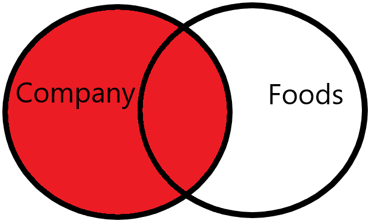
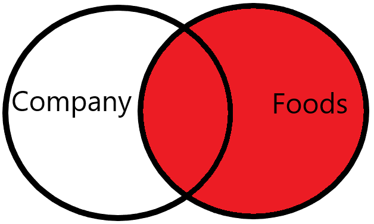
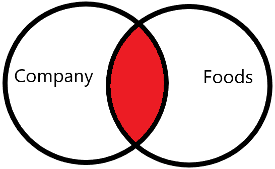

# Combining Data - Joins and multiple tables

Welcome to **SQL 102 - Intermediate SQL Queries**! In **SQL 101 - Introduction to Databases and Querying**, you learned how to write queries that selected, filtered, aggregated, and ordered data from a single table. In this class, we are going to add to your SQL toolbox by teaching you how to combine data from multiple tables to generate deeper insights. You will also learn more advanced querying techniques, such as using more advanced functions, subqueries, and more!

In this theory section, we will cover what you should know about joins in SQL. Understanding joins is crucial to being able to work with data in a database. Joins are also one of the most common technical interview topics that you will encounter, so they are definitely something you should work on! We will be walking you through what joins are and why we use them in this section. Then in the SQL 102 workbook, you will have plenty of practice writing your own queries to join data. 

By the time you're finished, you'll know enough to nail any questions on them in your next technical interview! 

## What are joins and why do we use them?

When we join data, we are combining two or more related tables into a single view. This is typically done to add context to your data based on your analysis needs. This is accomplished by using common attributes (or *columns*) to establish relationships between the tables, along with constraints that control how records (or *rows*) are matched between them. There are four primary join types that each have their own affect on query results.

### A hypothetical join scenario

For example, let's say we have two tables, one with `company` data and another with `product` data. It would be useful to see a combined view of companies and their products for an analysis or report. 

To do this, we would join the `customer` and `product` tables together using a common field (or fields) that establish a relationship between them. In a relational database, this is generally done using a primary key/foreign key relationship. Then we would establish a constraint to determine how the rows should be matched between the two tables in the resulting query. The most common constraint is to specify that only matching values between the tables be included in the join (Ex: `A.column_a = B.column_a`). 

### Working through an example of the most common join - the `INNER JOIN`

Joins can be a difficult topic, so we'll practice doing some together and explain everything that is happening as we go along.

The first type of join we'll work on is the `INNER JOIN`. This is the most common join that we will use. 

When we use an `INNER JOIN`, we are saying that we only want the rows from both tables that match constraints that we set. 

Let's assume that we have two tables - `A` and `B` - that we want to join together, only including the rows that are common to both of them. 

Here is what that query would look like:

```SQL
SELECT
    A.column1,
    B.column1
FROM A -- This is the table on the "left-side" of the join
-- Specifying the join type
INNER JOIN B -- This is the table on the "right-side" of the join
-- Specifying the join column (`column1`) and constraint (`=`)
ON A.column1=B.column1 
```

This is a visual representation of which rows will be returned between the two tables after the join:

**What gets matched between the two tables**


As you can see, we're keeping only the rows between the two tables that match based on our join columns and constraints. These query results will only include the rows that match our constraints while dropping the rest of the rows that don't match. 

>**<em>Pro-Tip:</em>** You don't need to specify the `INNER` for the `INNER JOIN` - you can simply use `JOIN`. However, it is good practice to be explicit when writing queries, so you are encouraged to use the `INNER` keyword whenever you mean an inner join.

### Join Syntax

When we write joins, we always specify the join type, column(s), and constraint(s) together. Joins come after the `FROM` clause and before the `WHERE` and `GROUP BY` clauses in our queries. 

To specify the type of join we want to use, here is the general form: 

`{Join Type} {name of table to join}`

**Example:** `INNER JOIN company`

To specify the column and constraint, we use the following form:

`{First Table.Column to join on} {constraint} {Second Table.Column to join on}`

**Example:** `foods.company_id=company.company_id`

Putting it all together, writing the join would look like:

```SQL
INNER JOIN company
ON foods.company_id=order_details.company_id
```

>**Extra Context:** <em>Dot Notation in Queries</em> 
>
>We typically use dot (`.`) notation when we join two or more tables in SQL. This is so that we don’t confuse the RDBMS when two tables have columns with the same name. 
>
>Here’s the general syntax: 
>
>`table_name.column_name`

### `LEFT JOIN`

A `LEFT JOIN` is the other most common join after `INNER JOIN`. The difference between the two is how the rows are matched in the query result. While an `INNER JOIN` includes only the rows that match from both tables, a `LEFT JOIN` will keep all the rows from the left-side of the join and only those that match from the right-side. When this happens, instead of dropping those records like the `INNER JOIN`, any values in unmatched rows are set to `NULL`. Visually, the matched rows will look like this:



If you're new to `LEFT JOIN`, you're probably wondering what was meant before by "left-side of the join." Visually, we can see that there is a table on the left side that has all of the records included with only the records at the intersection included from the right. But how does that translate to an actual query?

```SQL

SELECT *
FROM company -- This is the table on the "left-side" of the join
LEFT JOIN foods -- This table is on the "right-side" of the join
ON company.company_id=foods.company_id
```

Simply put, the table on the "left" of a join type is the one used in the `FROM` clause and the table on the "right" is the one specified after the join type (`LEFT JOIN` in this case.) Columns and constraints otherwise work the same as the `INNER JOIN`. The syntax is virtually identical between the two joins, but it's important to know how they work and the caveats for all join types.

### `INNER JOIN` vs `LEFT JOIN` - Caveats & Using them in Practice

#### Caveats

Looking at the result of the two queries, you should notice that the `LEFT JOIN` query gave you an extra record that was missing from the `INNER JOIN` query. The `sip-n-Bite` company is missing from our first query. Why?

Well, we know that we joined the two tables together based on matching `company_id`. We also know that `INNER JOIN` only keeps records from both tables that match. Since we know that the record exists in the `company` table, that must mean that there is no record for the `sip-n-Bite` company in the `foods` table. You can confirm this by looking at the `foods` table and querying for `company_id=19`, which will return no result since it doesn't exist.

#### When do I use one over the other?

Whether to use an `INNER JOIN` or a `LEFT JOIN` is something you must consider for your particular use case. Do you only want to consider the records that match between your tables? Then choose an `INNER JOIN`. Want to make sure that records are kept from the left side of the join? Then - you guessed it - use a `LEFT JOIN`.

#### Practical Usage

By and large, the majority of your joins in practice will either be an `INNER JOIN` or a `LEFT JOIN`. It is worth it to learn them well and become really comfortable with using them, as well as knowing when to use them. The other joins mentioned are not used as much in practice, but it's good to know about them - especially for technical interviews!

### Right Joins

As mentioned earlier, `RIGHT JOIN` is rarely used in practice. This is because you can do the same thing using just a `LEFT JOIN`, so there aren't many (if any) use cases where you would want to exclusively use it. However, it is a join type to be aware of and is commonly asked about in interviews, so let's cover it.

The opposite of the `LEFT JOIN`, `RIGHT JOIN` includes all the records from the "right-side" of the join and only records that match from the "left-side". Also, similar to `LEFT JOIN`, values in records from the other side of the join that don't match are set to `null` and included in our query results. Visually, the resulting matches look like this:



Here is the query breakdown:

```SQL

SELECT *
FROM company -- This is the table on the "left-side" of the join
RIGHT JOIN foods -- This table is on the "right-side" of the join
ON foods.company_id=company.company_id
```

Syntactically, it is almost identical to the other joins. Let's run a `RIGHT JOIN` query and see the results.

### Full Outer Joins

`FULL OUTER JOIN` is another join type that isn't used as often as left or inner joins in practice, but it is much more common than the `RIGHT JOIN`. We use `FULL OUTER JOIN` when we want to include all the records from both sides of the join, showing the records that match between the two and otherwise giving null values where there isn't a match between the tables. A `FULL OUTER JOIN` is like a combination of both the left and right join types.

Here is how the matching looks visually:


The query syntax is pretty much identical to the others, aside from specifying the join type itself:

```SQL
SELECT *
FROM company
FULL OUTER JOIN foods
ON company.company_id=foods.food_id
```

### Summary

Overall, there are **four join types** that you should be aware of (and which we will cover):

- `INNER JOIN`: Only keep the records that match the constraint between the two tables

    

- `LEFT JOIN`: Keep all the records from the left-side of the join, and only show values for the records on the right-side that matched. Any values from the right-side that weren't matched will be assigned a `null` value.

    

- `RIGHT JOIN`: The opposite of the `LEFT JOIN` - keep all the records from the right-side of the join and only show values for the records on the left-side that matched. Any values from the left-sie that weren't matched will be assigned a `null` value.

    

- `FULL OUTER JOIN`: Keep all records between both tables, but only show the values that match my constraint. All other records that don't match will be included, but those values will be set to null.

    

We will dive a bit deeper into the details of each of these join types as we work through some practical examples in the SQL 102 Notebook. Also, these are only four join types out of many. There are some more advanced joins, like [cross-joins, natural joins, and self-joins](https://www.linkedin.com/pulse/what-difference-between-natural-joincross-join-self-madhu-mitha-k) that you should eventually become familiar with as you enhance your skills and understanding.


## Practical considerations for selecting attributes/columns for joins

Joining datasets usually depends on primary and foreign key relationships, but these aren't always clear (or available), especially with unfamiliar data. In such cases, understanding the data's origin, purpose, and contents can help. This can be done by finding documentation like data dictionaries or entity relationship diagrams (ERDs) or consulting with subject matter experts.

If there's no documentation or experts, exploratory data analysis becomes crucial. This involves understanding column data types, summary statistics, and identifying missing values. Aim to identify unique identifier columns, or potential primary keys for joins, which should be unique and non-null. [The information_schema](https://en.wikipedia.org/wiki/Information_schema), found in most relational databases, can also provide helpful metadata.

The last step in joining datasets is connecting tables using primary keys identified earlier. If key relationships are known, this is simple. Otherwise, analyze and understand primary keys, look for common columns, and try joining. Duplicates after joining suggest incorrect column usage. This illustrates why it is crucial for you to understand your data.