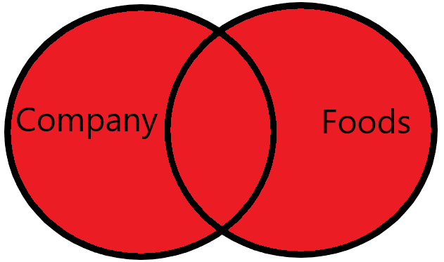

# SQL 102 - Intermediate Queries

By: Martin Arroyo

### Table of Contents:

* [**Introduction: Combining Data - Joins and multiple tables**](#introduction-combining-data---joins-and-multiple-tables)

* [**What are joins and why do we use them?**](#what-are-joins-and-why-do-we-use-them)
    - [**A hypothetical join scenario**](#a-hypothetical-join-scenario)

* [**`INNER JOIN` - Working together through an example of the most common join**](#inner-join---working-together-through-an-example-of-the-most-common-join)
    - [**Join Syntax**](#join-syntax)

* [**`LEFT JOIN`**](#left-join)
        
* [**INNER JOIN` vs `LEFT JOIN` - Caveats & Using them in Practice**](#inner-join-vs-left-join---caveats--using-them-in-practice)
    - [**Caveats**](#caveats)
    - [**When do I use one over the other?**](#when-do-i-use-one-over-the-other)
    - [**Practical Usage**](#practical-usage)

* [**A Walkthrough of a Practical `JOIN` Example**](#a-walkthrough-of-a-practical-join-example)

* [**`RIGHT JOIN`**](#right-join)

* [**`FULL OUTER JOIN`**](#full-outer-join)

* [**Practical considerations for selecting columns for joins**](#practical-considerations-for-selecting-columns-for-joins)

* [**Summary**](#summary)


## Introduction: Combining Data - Joins and multiple tables

Welcome to **SQL 102 - Intermediate SQL Queries**! In **SQL 101 - Introduction to Databases and Querying**, you learned how to write queries that selected, filtered, aggregated, and ordered data from a single table. In this class, we are going to add to your SQL toolbox by teaching you how to combine data from multiple tables to generate deeper insights. You will also learn more advanced querying techniques, such as using more advanced functions, subqueries, and more!

In this theory section, we will cover what you should know about joins in SQL. Understanding joins is crucial to being able to work with data in a database, since you will be dealing with more than just one table more often than not. Joins are also one of the most common technical interview topics that you will encounter, so they are definitely something you should work on! 

We will walk you through what joins are and why we use them in this section. Then, in the following SQL 102 notebook, you will have plenty of practice writing your own queries to join data. By the time you're finished, you'll know enough to nail any questions on joins in your next technical interview! 

[Back to top](#table-of-contents)

## What are joins and why do we use them?

Databases generally have more than one table. And since databases store tables that are (generally) related to one another, we need a way to combine data from multiple tables. We're going to use our fictional restaurant database from SQL 101 as an example. You may recall that there is a `Customers` table which keeps track of our customer demographic information. There is also a `Reservations` table, which keeps tracks of reservations made by customers. If we want to answer a question like, <em>"What are the top 5 states that our all-time most frequent customers come from?"</em>, then we need to combine the data from those two tables.  

When we join data, we are combining two or more related tables into a single view to add context to our data to generate more holistic insights. We use common attributes (or *columns*) to establish relationships between the tables, along with constraints that control how records (or *rows*) are matched between them. In SQL 101, we mentioned that these relationships are often (but not always) established using primary keys and foreign keys. 

There are four fundamental join types that you should know about in SQL - `INNER`, `LEFT`, `RIGHT`, and `FULL OUTER` joins. Each join type provides slightly different results, and you select the type to use based on what your analysis calls for. Other join types that you should be aware of are the [`CROSS`, `SELF`, and `NATURAL` joins](https://www.linkedin.com/pulse/what-difference-between-natural-joincross-join-self-madhu-mitha-k). We will not cover these last three types explicitly, but we encourage you to read about them on your own time.

### A hypothetical join scenario

Let's return to our hypothetical join scenario: using the `Customers` and `Reservations` table from our restaurant database to answer, **<em>"What are the top 5 states that our all-time most frequent customers come from?"</em>** How would we do this? 

To do this, we would join the `customer` and `order` tables together using a common field (or fields) that establishes a relationship between them. In relational databases, this is usually done using a primary key/foreign key relationship. This is not always the case - it's possible to join fields that don't have an established Primary Key/Foreign Key relationship - but it's one of the most common. If there isn't a primary/foreign key relationship, you can use any columns that have matching data types and values.

Next, we would create some constraint that determines which rows from the `Customers` table should be matched with what rows in the `Reservations` table in our query result. Usually our constraint would say something like, **</em>"Give me all the rows where the value in the column from this table is the same as the value in the column from that table."</em>**  

>**Example Constraint:** `Orders.customer_id = Customers.id`

The query for this example would look like:

```sql
SELECT C.State, COUNT(R.ReservationID) AS total_reservations -- We are counting the number of reservations by each state
FROM Reservations AS R -- The 'Reservations' table is on the "left-side" of the join. We give it an alias of 'R'
INNER JOIN Customers AS C -- The 'Customers' table is on the "right-side" of the join. We give it an alias of 'C'
ON R.CustomerID=C.CustomerID -- This is our constraint saying "Only give me the rows where the customer id in 'Orders' matches the id in 'Customers'" 
GROUP BY C.State -- We're summarizing our results by what state our customers are from
ORDER BY total_reservations DESC -- Since we want to know which states have the most reservations, we order the counts from greatest to least
LIMIT 5 -- We only want to see the 5 states with the most reservations, so we limit our results to the first 5 rows
```

This is slightly more complex query than what you may be used to writing coming from SQL 101, but [we will break this down line-by-line a little later on.](#a-walkthrough-of-a-practical-join-example). 

First, we'll introduce you to the basics of joins using simpler examples. Then we'll come return to this more "real world" example and break down how it works. 

[Back to top](#table-of-contents)

## `INNER JOIN` - Working together through an example of the most common join

Joins can be a difficult topic, so we'll practice doing some together and explain everything that is happening as we go along.

The first type of join we'll work on is the `INNER JOIN`. This is the most common join that we will use. 

When we use an `INNER JOIN`, we are saying that we only want the rows from both tables that match constraints that we set. 

Let's assume that we have two tables - `A` and `B` - that we want to join together, only including the rows that are common to both of them. 

Here is what that query would look like:

```SQL
SELECT
    A.column1,
    B.column1
FROM A -- This is the table on the "left-side" of the join
-- Specifying the join type
INNER JOIN B -- This is the table on the "right-side" of the join
-- Specifying the join column (`column1`) and constraint (`=`)
ON A.column1=B.column1 
```

This is a visual representation of which rows will be returned between the two tables after the join:

**What gets matched between the two tables**


As you can see, we're keeping only the rows between the two tables that match based on our join columns and constraints. These query results will only include the rows that match our constraints while dropping the rest of the rows that don't match. 

>**<em>Pro-Tip:</em>** You don't need to specify the `INNER` for the `INNER JOIN` - you can simply use `JOIN`. However, it is good practice to be explicit when writing queries, so you are encouraged to use the `INNER` keyword whenever you mean an inner join.

[Back to top](#table-of-contents)

### Join Syntax

We're going to use two tables from another fictitious database for the following examples - `Company` and `Foods`. The `Company` table has information about different foods companies, and `Foods` has information about food products sold by the companies in `Company`. They have a primary key/foreign key relationship using the `company_id` column found in each table. Our goal is to simply join the two tables together to see the company information associated with each food product. 

**Writing Join Queries**

When we write joins, we always specify the join type, column(s), and constraint(s) together. Joins come after the `FROM` clause and before the `WHERE` and `GROUP BY` clauses in our queries. 

To specify the type of join we want to use, here is the general form: 

`{Join Type} {name of table to join}`

**Example:** `INNER JOIN Foods`

To specify the column and constraint, we use the following form:

`{First Table.Column to join on} {constraint} {Second Table.Column to join on}`

**Example:** `Company.company_id=Foods.company_id`

Putting it all together, writing the join would look like:

```SQL
INNER JOIN Foods
ON Company.company_id=Foods.company_id
```

>**Extra Context:** <em>Dot Notation in Queries</em> 
>
>We typically use dot (`.`) notation when we join two or more tables in SQL. This is so that we don’t confuse the RDBMS when two tables have columns with the same name. 
>
>Here’s the general syntax: 
>
>`table_name.column_name`

Now let's put the whole query together now and see the how it all works:

```sql
SELECT *
FROM Company
INNER JOIN Foods
ON Company.company_id=Foods.company_id
```


As you can see, one row in each of the tables gets dropped from the final result. This happened because the value for `company_id` in these rows did not exist in both tables. Only the rows where the value for `company_id` exists in both tables are included since that is how they are matched. 
 
[Back to top](#table-of-contents)

## `LEFT JOIN`

A `LEFT JOIN` is the other most common join after `INNER JOIN`. The difference between the two is how the rows are matched in the query result. While an `INNER JOIN` includes only the rows that match from both tables, a `LEFT JOIN` will keep all the rows from the left-side of the join and only those that match from the right-side. When this happens, instead of dropping those records like the `INNER JOIN`, any values in unmatched rows are set to `NULL`. Visually, the matched rows will look like this:


If you're new to `LEFT JOIN`, you're probably wondering what was meant before by "left-side of the join." Visually, we can see that there is a table on the left side that has all of the records included with only the records at the intersection included from the right. But how does that translate to an actual query?

```SQL
SELECT *
FROM Company -- This is the table on the "left-side" of the join
LEFT JOIN Foods -- This table is on the "right-side" of the join
ON Company.company_id=Foods.company_id
```

Simply put, the table on the "left" of a join type is the one used in the `FROM` clause and the table on the "right" is the one specified after the join type (`LEFT JOIN` in this case.) Columns and constraints otherwise work the same as the `INNER JOIN`. The syntax is virtually identical between the two joins, but it's important to know how they work and the caveats for all join types.

[Back to top](#table-of-contents)

## `INNER JOIN` vs `LEFT JOIN` - Caveats & Using them in Practice

### Caveats

Looking at the result of the two queries, you should notice that the `LEFT JOIN` query gave you an extra record that was missing from the `INNER JOIN` query. The `sip-n-Bite` company is missing from our first query. Why?

Well, we know that we joined the two tables together based on matching `company_id`. We also know that `INNER JOIN` only keeps records from both tables that match. Since we know that the record exists in the `company` table, that must mean that there is no record for the `sip-n-Bite` company in the `foods` table. You can confirm this by looking at the `foods` table and querying for `company_id=19`, which will return no result since it doesn't exist.

### When do I use one over the other?

Whether to use an `INNER JOIN` or a `LEFT JOIN` is something you must consider for your particular use case. Do you only want to consider the records that match between your tables? Then choose an `INNER JOIN`. Want to make sure that records are kept from the left side of the join? Then - you guessed it - use a `LEFT JOIN`.

### Practical Usage

By and large, the majority of your joins in practice will either be an `INNER JOIN` or a `LEFT JOIN`. It is worth it to learn them well and become really comfortable with using them, as well as knowing when to use them. The other joins mentioned are not used as much in practice, but it's good to know about them - especially for technical interviews!

[Back to top](#table-of-contents)

## A Walkthrough of a Practical `JOIN` Example

Remember our hypothetical join scenario and the complex query we wrote from earlier? Now that you have some more exposure to joins, let's revisit this query line-by-line. First, let's reiterate the question and the query:

**Question:** <em>"What are the top 5 states that our most frequent customers come from?"</em>

**Query:**
```sql
SELECT C.State, COUNT(R.ReservationID) AS total_reservations -- We are counting the number of reservations by each state
FROM Reservations AS R -- The 'Reservations' table is on the "left-side" of the join. We give it an alias of 'R'
INNER JOIN Customers AS C -- The 'Customers' table is on the "right-side" of the join. We give it an alias of 'C'
ON R.CustomerID=C.CustomerID -- This is our constraint saying "Only give me the rows where the customer id in 'Orders' matches the id in 'Customers'" 
GROUP BY C.State -- We're summarizing our results by what state our customers are from
ORDER BY total_reservations DESC -- Since we want to know which states have the most reservations, we order the counts from greatest to least
LIMIT 5 -- We only want to see the 5 states with the most reservations, so we limit our results to the first 5 rows
```

Let's step through each line together and break down what's happening:

```sql
SELECT C.State, COUNT(R.ReservationID) AS total_reservations
```

We're selecting the `State` column from the `Customers` table and counting the total number of reservations from the `Reservations` table for each state. We have created aliases for each table - `C` for `Customers` and `R` for `Reservations`. This is common practice when we write join queries. If two tables have columns with the same name, SQL needs a way to understand which table and columns you are referring to in your query. This is why we use `C.State`, which is using the `State` column from the `Customers` table.

```sql
FROM Reservations AS R
```

Here we started with the `Reservations` table, and we gave it an alias, `R`. This will allow us to refer to the table using `R` instead of the full name; it's simply a shortcut for us so we don't need to use the full name of the table each time we reference it. We say the `Reservations` is on the "left-side" of the join since it is in the `FROM` clause.  

```sql
INNER JOIN Customers AS C
```

This is where we indicate the type of join we want and our intent to join the `Customers` table. We have specified an `INNER` join as the type of join that we want to use. We gave the `Customers` table an alias of `C` to make it easier to reference.

```sql
ON R.CustomerID=C.CustomerID
```

Our constraint is specified on this line. Here, our constraint says, **<em>"Only match the rows between the two tables that have matching customer IDs."</em>** Or in other words, **<em>"make sure the reservations are associated with the correct customer using their ID number."</em>**
 
```sql
GROUP BY C.State
```

We want to know the total number of reservations by state, so that's the column we use in our `GROUP BY`.

```sql
ORDER BY total_reservations DESC
LIMIT 5
```

Here, since the question asks us to only show the top 5 states in our results, we:

1. Use the `ORDER BY` clause to first sort our results by the number of total reservations, from greatest to least. 
2. Since we only want the top 5, we use `LIMIT 5` to restrict the results to just the first 5 rows

This was a complex query that answered a very practical question for our restaurant! It demonstrates how we can combine the querying concepts that we have learned so far to answer more and more sophisticated questions from the data. 

Also, consider the fact that you would not be able to answer this question using either `Customers` or `Reservations` alone. It was only after combining them that you were able to get deeper insights. That's a large part of why joins are useful and often necessary.

Now we'll continue on to the other two fundamental joins you should know: `RIGHT` and `FULL OUTER` joins.

[Back to top](#table-of-contents)

## `RIGHT JOIN`

As mentioned earlier, `RIGHT JOIN` is rarely used in practice. This is because you can do the same thing using just a `LEFT JOIN`, so there aren't many (if any) use cases where you would want to exclusively use it. However, it is a join type to be aware of and is commonly asked about in interviews, so let's cover it.

The opposite of the `LEFT JOIN`, `RIGHT JOIN` includes all the records from the "right-side" of the join and only records that match from the "left-side". Also, similar to `LEFT JOIN`, values in records from the other side of the join that don't match are set to `null` and included in our query results. Visually, the resulting matches look like this:


Here is the query breakdown:

```SQL
SELECT *
FROM Company -- This is the table on the "left-side" of the join
RIGHT JOIN Foods -- This table is on the "right-side" of the join
ON Foods.company_id=Company.company_id
```

Syntactically, it is almost identical to the other joins. Let's run a `RIGHT JOIN` query and see the results.

[Back to top](#table-of-contents)

## `FULL OUTER JOIN`

`FULL OUTER JOIN` is another join type that isn't used as often as left or inner joins in practice, but it is much more common than the `RIGHT JOIN`. We use `FULL OUTER JOIN` when we want to include all the records from both sides of the join, showing the records that match between the two and otherwise giving null values where there isn't a match between the tables. A `FULL OUTER JOIN` is like a combination of both the left and right join types.

Here is how the matching looks visually:




The query syntax is pretty much identical to the others, aside from specifying the join type itself:

```SQL
SELECT *
FROM Company
FULL OUTER JOIN Foods
ON Company.company_id=Foods.food_id
```

[Back to top](#table-of-contents)

## Practical considerations for selecting columns for joins

Joining datasets usually depends on primary and foreign key relationships, but these relationships may not always be clear (or available.) You may find yourself in a situation like this when dealing with a new data set. In these cases, understanding the data's origin, purpose, and contents can help. This can be done by finding documentation like data dictionaries or entity relationship diagrams (ERDs) or consulting with subject matter experts.

If there's no documentation and no experts are available, exploratory data analysis becomes crucial. This involves understanding column data types, summary statistics, and identifying missing values.  Look for unique identifier columns, or possible primary keys - the values in these columns should be unique and non-null. [The information_schema](https://en.wikipedia.org/wiki/Information_schema), found in most relational databases, may also provide helpful metadata that can point to relationships.

To sum things up, you should always attempt to find any documentation available for the data you are using in order to understand how you can connect tables together. Additionally, seek out help from subject matter experts who know the data well. If you can find neither of these sources for a data set you are working with, then exploratory data analysis becomes crucial. You will need to develop an understanding of the data to help you pick out the columns that can be used to join the tables together for your analysis.

[Back to top](#table-of-contents)

## Summary

Overall, there are **four join types** that you should know well:

- `INNER JOIN`: Only keep the records that match the constraint between the two tables

- `LEFT JOIN`: Keep all the records from the left-side of the join, and only show values for the records on the right-side that matched. Any values from the right-side that weren't matched will be assigned a `null` value.

- `RIGHT JOIN`: The opposite of the `LEFT JOIN` - keep all the records from the right-side of the join and only show values for the records on the left-side that matched. Any values from the left-sie that weren't matched will be assigned a `null` value.

- `FULL OUTER JOIN`: Keep all records between both tables, but only show the values that match my constraint. All other records that don't match will be included, but those values will be set to null.

Now you know the theory behind the most fundamental types of joins in SQL. In the theory section of 102, you will use everything you learned here and apply it to write queries to help you generate more insights for our fictional restaurant. 

The join types mentioned here are the most important to know, but there are a few more join types that you may come across. There are some more advanced joins, like [cross-joins, natural joins, and self-joins](https://www.linkedin.com/pulse/what-difference-between-natural-joincross-join-self-madhu-mitha-k) that you should eventually become familiar with as you enhance your skills and understanding.

[Back to top](#table-of-contents)